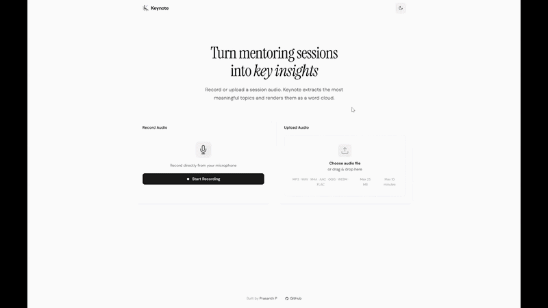

# Keynote — Session Word Cloud

Upload or record a mentoring session. Keynote extracts the key topics and renders them as an interactive word cloud.



---

## What it does

- Record audio directly in the browser or upload a file (MP3, WAV, M4A, AAC, OGG, WEBM, FLAC — up to 25 MB, 10 minutes).
- Sends audio to a Cloudflare Worker, which proxies it to Gemini for transcription and semantic topic extraction.
- Renders extracted topics as a weighted, interactive D3 word cloud.
- Exports the cloud as a PNG. Saves past analyses to localStorage with a history panel.
- Everything listed above works fully.

---

## Run locally

```bash
git clone https://github.com/PrasanthPradeep/keynote.git
cd keynote
npm install
cp .dev.vars.example .dev.vars   # add your GEMINI_API_KEY inside
npm run dev:all
```

App runs at `http://localhost:5173`. `dev:all` starts both the Vite dev server and the Cloudflare Worker proxy concurrently.

**Environment variable:**

| Variable | Where | Purpose |
|---|---|---|
| `GEMINI_API_KEY` | `.dev.vars` (local) / Wrangler secret (prod) | Gemini REST API access |

---

## AI service — Gemini Flash

Used Google Gemini Flash (`gemini-2.0-flash` with `gemini-1.5-flash` as automatic fallback).

Chosen because: Gemini's multimodal API accepts raw audio bytes directly — no separate transcription step needed. A single request returns both transcript and structured JSON topics. GPT-4o Audio and Whisper require a two-call pipeline (transcribe, then extract). Gemini Flash also fits within a generous free tier, which matters for a submission running on a shared API key.

---

## Decisions

**Cloudflare Worker as API proxy, not a Node server.**
The `GEMINI_API_KEY` must never reach the browser bundle. A Worker sits in front, handles the Gemini call, and the key lives only in Wrangler secrets. It also means zero-config deployment — no separate server to run or maintain.

**Semantic extraction over word frequency.**
Splitting transcript text and counting words produces noise (filler words, articles, repeated phrases). Prompting Gemini to return a structured JSON list of conceptual topics with relative weight scores gives results that are actually meaningful for a mentoring context.

**No backend persistence.**
History is stored in `localStorage` only. Deliberately avoided a database — this is a single-user browser tool, persistence beyond the session is a convenience feature, and adding a DB would introduce auth, hosting cost, and scope beyond what the brief requires.

---

## Libraries and external code

| Library | Purpose |
|---|---|
| `react`, `react-dom` | UI framework |
| `d3`, `d3-cloud` | Word cloud layout and canvas rendering |
| `vite` | Dev server and build tooling |
| `wrangler` | Cloudflare Worker dev and deployment CLI |

No UI component libraries, templates, or starter kits were used. All component and styling code is original.

---

## AI tools used

OpenCode & Kiro (AI coding assistant) was used throughout development for:

- **Requirement analysis** — breaking the brief into concrete acceptance criteria before writing any code.
- **Checklist and audit** — verifying implemented features against the brief requirements at each stage.
- **Code review** — identifying logic errors, edge cases, and inconsistencies across files.
- **Bug finding** — including catching a silent failure where `xhr.ok` (a `fetch` API property) was used on an `XMLHttpRequest` object, causing all successful 200 responses to be treated as errors.
- **UI polish** — refining loading states, progress indicators, and error messaging.

All architectural decisions, feature scoping, and final implementation were made by myslef.

---

## Next week

In priority order:

1. **Segment linking** — click a word in the cloud to jump to the relevant passage in the current transcript section.
2. **Settings page with profile sign-in** — user accounts to persist history across devices and sessions, replacing the current localStorage-only approach.
3. **Bring your own API key** — allow signed-in users to supply their own Gemini API/any other model key via the settings page, removing the dependency on the shared backend key.
4. **Live transcript** — stream the live response during recording so the transcript appears in real time rather than after the full upload completes.
5. **Export summary** — downloadable Markdown or PDF report combining the word cloud image, transcript, and topic list for sharing session notes.
6. **Shareable session link** — generate a short URL after analysis that opens a read-only view of the word cloud and transcript for the mentee, no account required. Backed by Cloudflare KV for lightweight persistence, with a configurable expiry.
7. **Multi-language support** — Gemini handles non-English audio; the prompt and UI need minor adjustments to surface that capability.

---

Brief ref: TFG-WD-4417
